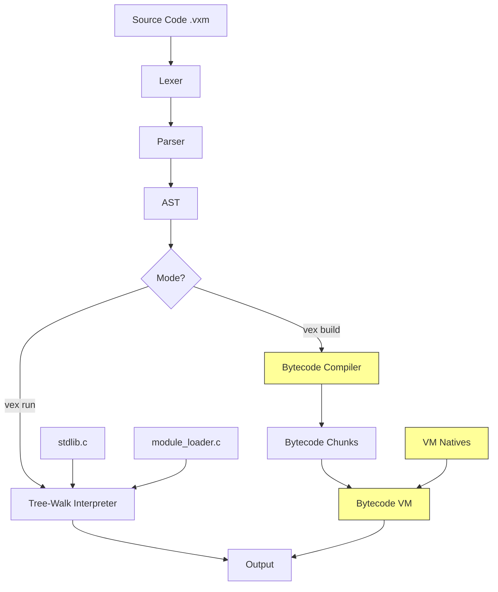

# Vexium Language - Continuation Build Plan

> **Created**: 2026-03-03
> **Status**: Ready for implementation
> **Scope**: Complete the Vexium v2 language from .md specifications to working code

---

## Current State Analysis

### What Exists

The Vexium language has a working **tree-walk interpreter** (v1) and a **partial bytecode VM** (v2). The codebase is written in C99 with the following source files:

| File | Purpose | Completeness |
|------|---------|-------------|
| [`lexer.c`](vex/src/lexer.c) | Tokenization (35 keywords) | ✅ 100% |
| [`token.c`](vex/src/token.c) | Token utilities | ✅ 100% |
| [`parser.c`](vex/src/parser.c) | Recursive descent parser | ✅ 100% |
| [`ast.c`](vex/src/ast.c) | AST node creation/printing | ✅ 100% |
| [`interpreter.c`](vex/src/interpreter.c) | Tree-walk interpreter | ✅ 95% |
| [`compiler.c`](vex/src/compiler.c) | AST → Bytecode compiler | 🔧 60% |
| [`vm.c`](vex/src/vm.c) | Stack-based bytecode VM | 🔧 70% |
| [`stdlib.c`](vex/src/stdlib.c) | Standard library (interpreter only) | 🔧 40% |
| [`module_loader.c`](vex/src/module_loader.c) | User module loading | 🔧 30% |
| [`main.c`](vex/src/main.c) | CLI entry point | 🔧 35% |

### Gap Analysis: Compiler vs Interpreter

The interpreter handles these AST node types that the **compiler does NOT**:

| Feature | Interpreter | Compiler | VM |
|---------|------------|----------|-----|
| `NODE_FIELD_ACCESS` | ✅ | ❌ | ❌ No opcode |
| `NODE_LAMBDA` | ✅ | ❌ | ❌ |
| `NODE_LIST_COMP` | ✅ | ❌ | ❌ |
| `NODE_STRUCT_DECL` | ✅ | ❌ | ❌ No object type |
| `NODE_ATTEMPT` | ✅ Basic | ❌ | ❌ No try/catch |
| `NODE_USE` / `NODE_FROM_USE` | ✅ | ❌ Skipped | ❌ |
| `NODE_BREAK` / `NODE_SKIP` | ✅ | ❌ No-op | ❌ |
| Closures/Upvalues | ✅ | ❌ | ❌ No upvalue support |

### Gap Analysis: Spec vs Implementation

From [`language_v2_spec.md`](language_v2_spec.md) and implementation guides:

| Feature | Specified | Implemented |
|---------|-----------|-------------|
| Gradual type system | ✅ In spec | ❌ Not started |
| Error objects with stack traces | ✅ In spec | ❌ Basic flag only |
| Struct inheritance | ✅ In spec | ❌ Parsed but not executed |
| JSON module | ✅ In spec | ❌ Not started |
| HTTP module | ✅ In spec | ❌ Not started |
| Time module | ✅ In spec | ❌ Not started |
| REPL | ✅ In spec | ❌ Not started |
| Bytecode caching | ✅ In spec | ❌ Not started |
| Garbage collection | ✅ In spec | ❌ Free-all-on-exit only |
| Map field access in VM | ✅ Implied | ❌ Only array indexing |

---

## Architecture Overview



The yellow-highlighted components are the primary targets for this build phase.

---

## Implementation Phases

### Phase 1: Complete Bytecode Compiler

**Goal**: Make the compiler handle ALL AST node types that the interpreter handles.

#### 1a. Break/Skip Loop Control

The compiler currently treats `NODE_BREAK` and `NODE_SKIP` as no-ops. They need jump patching.

**Changes to [`compiler.c`](vex/src/compiler.c)**:
- Add a loop context stack tracking `loop_start` and break jump locations
- `NODE_BREAK` → emit `OP_JMP` to after loop, patch later
- `NODE_SKIP` → emit `OP_LOOP` back to loop start

#### 1b. Field Access

**Changes to [`opcodes.h`](vex/src/opcodes.h)**:
- Add `OP_GET_FIELD` and `OP_SET_FIELD` opcodes

**Changes to [`compiler.c`](vex/src/compiler.c)**:
- Compile `NODE_FIELD_ACCESS` → push object, push field name constant, emit `OP_GET_FIELD`

**Changes to [`vm.c`](vex/src/vm.c)**:
- Handle `OP_GET_FIELD` for maps and instances
- Handle `OP_SET_FIELD` for maps and instances

#### 1c. Lambda Expressions

**Changes to [`compiler.c`](vex/src/compiler.c)**:
- Compile `NODE_LAMBDA` same as `NODE_FN_DECL` but without defining a global name
- Push the resulting `ObjFunction` as a value on the stack

#### 1d. List Comprehensions

**Changes to [`compiler.c`](vex/src/compiler.c)**:
- Desugar `[expr for each x in iter if cond]` into:
  1. Create empty array
  2. For-each loop over iterable
  3. If condition passes, evaluate expr and push to array
  4. Result is the array

#### 1e. Closures and Upvalues

This is the most complex addition. Currently the VM has no upvalue support.

**Changes to [`opcodes.h`](vex/src/opcodes.h)**:
- Add `OBJ_CLOSURE` object type wrapping `ObjFunction` + upvalue array
- Add `ObjUpvalue` struct for captured variables
- Add `OP_CLOSURE`, `OP_GET_UPVALUE`, `OP_SET_UPVALUE`, `OP_CLOSE_UPVALUE`

**Changes to [`compiler.c`](vex/src/compiler.c)**:
- Track upvalues per compiler scope
- `resolve_upvalue()` function to walk enclosing scopes
- Emit `OP_CLOSURE` instead of raw `OP_CONST` for functions that capture variables

**Changes to [`vm.c`](vex/src/vm.c)**:
- `CallFrame` stores `ObjClosure*` instead of `ObjFunction*`
- Implement upvalue capture and close-over semantics

---

### Phase 2: Error Handling System

**Goal**: Implement `attempt`/`otherwise` blocks with proper error objects.

#### 2a. Error Value Type

**Changes to [`opcodes.h`](vex/src/opcodes.h)**:
- Add `OBJ_ERROR` type
- Add `ObjError` struct with message, type, line, file fields

#### 2b-2c. Try/Catch Opcodes and Compilation

**New opcodes**:
- `OP_TRY_BEGIN` [catch_offset] — push exception handler
- `OP_TRY_END` — pop exception handler
- `OP_THROW` — raise error, unwind to nearest handler

**Compiler changes**:
```
compile NODE_ATTEMPT:
  emit OP_TRY_BEGIN [catch_jump]
  compile try_block
  emit OP_TRY_END
  emit OP_JMP [end_jump]
  patch catch_jump:
    if error_name: define local with error value
    compile catch_block
  patch end_jump
```

#### 2d. VM Error Propagation

**Changes to [`vm.c`](vex/src/vm.c)**:
- Add exception handler stack to VM struct
- On `OP_THROW` or runtime error: check handler stack, unwind frames, jump to catch
- If no handler: print error and halt

#### 2e. Predefined Error Types

Add helper functions to create typed errors:
- `TypeError`, `ValueError`, `RuntimeError`, `IndexError`, `KeyError`, `IOError`

---

### Phase 3: Struct System in VM

**Goal**: Compile and execute struct definitions, instantiation, and method calls.

#### 3a-3b. Object Types and Opcodes

**New object types in [`opcodes.h`](vex/src/opcodes.h)**:
- `OBJ_STRUCT_DEF` — stores field names, method functions
- `OBJ_INSTANCE` — stores struct reference + field values map

**New opcodes**:
- `OP_STRUCT_DEF` — define a struct type
- `OP_CONSTRUCT` — create instance from struct def
- `OP_GET_FIELD` / `OP_SET_FIELD` — already added in Phase 1b

#### 3c-3d. Compilation and VM Execution

**Compiler**: Compile `NODE_STRUCT_DECL` to emit struct definition with field names and compiled methods.

**VM**: Handle construction calls (when callee is a struct def), field access on instances, method dispatch with `self` binding.

---

### Phase 4: Module System for VM

**Goal**: Make `use` and `from...use` work in the bytecode VM path.

#### 4a-4b. Import Opcodes

**New opcodes**:
- `OP_IMPORT` [module_name_idx] — load entire module
- `OP_IMPORT_FROM` [module_name_idx] [symbol_name_idx] — load specific symbol

#### 4c. VM Module Loading

**Changes to [`vm.c`](vex/src/vm.c)**:
- Add module cache to VM struct
- On `OP_IMPORT`: check if stdlib module, register natives; else load .vxm file, compile, execute in isolated scope, export globals

#### 4d. Expand VM Native Builtins

Currently the VM only has 12 native functions. Add all the math/string/collections functions that exist in the interpreter stdlib:
- `sin`, `cos`, `tan`, `floor`, `ceil`, `round`, `log`, `min`, `max`, `random`
- `upper`, `lower`, `trim`, `contains`, `starts_with`, `ends_with`, `replace`, `split`, `join`
- `sort`, `slice`, `index_of`, `reverse`

---

### Phase 5: Stdlib Expansion

**Goal**: Add missing stdlib modules specified in the docs.

#### 5a. JSON Module

- `json_parse(str)` → VexValue map/array
- `json_stringify(val)` → string
- Implement recursive JSON parser in C

#### 5b. Time Module

- `time_now()` → timestamp
- `time_format(ts, fmt)` → formatted string
- `time_sleep(ms)` → pause execution

#### 5c. HTTP Module (Basic)

- `http_get(url)` → response string
- `http_post(url, body)` → response string
- Use platform sockets or libcurl

#### 5d. Register for VM

Create `vm_register_stdlib()` that registers all stdlib functions as VM natives.

---

### Phase 6: CLI Enhancements

**Goal**: Add missing CLI commands from the spec.

#### 6a. REPL (`vex repl`)

- Read-eval-print loop
- Parse and execute line by line
- Maintain persistent environment across lines
- Show results of expressions

#### 6b. Type Checker (`vex check`)

- Walk AST and infer types
- Report type mismatches
- Optional strict mode

#### 6c. Formatter (`vex fmt`)

- Parse source to AST
- Pretty-print AST back to source with consistent indentation

#### 6d. Test Runner (`vex test`)

- Find `test_*.vxm` files
- Run each, report pass/fail
- Support `assert()` builtin

---

### Phase 7: VM Optimizations

#### 7a. Bytecode Caching

- Serialize compiled bytecode to `.vxmc` files
- Check source modification time vs cache
- Load cached bytecode when available

#### 7b. Constant Folding

- Pre-evaluate constant expressions at compile time
- `3 + 4` → emit `OP_CONST 7` instead of `OP_CONST 3; OP_CONST 4; OP_ADD`

#### 7c. Dead Code Elimination

- Remove unreachable code after `give back`, `break`
- Remove unused variable definitions

#### 7d. Mark-Sweep GC

- Track all heap objects via `Obj*` linked list (already exists)
- Add mark phase: walk stack, globals, call frames
- Add sweep phase: free unmarked objects
- Trigger GC when allocation count exceeds threshold

---

### Phase 8: Testing and Validation

- Create comprehensive test files for each new feature
- Ensure all existing interpreter tests pass on VM backend
- Add regression tests for edge cases

---

## Recommended Implementation Order

The phases should be implemented in order 1 → 8, as each builds on the previous. Within each phase, the sub-tasks are also ordered by dependency.

**Critical path**: Phase 1 → Phase 2 → Phase 3 → Phase 4

These four phases bring the VM to feature parity with the interpreter and are the highest priority.

**Nice-to-have**: Phase 5 → Phase 6 → Phase 7

These add polish and new features but aren't blocking.

**Validation**: Phase 8 should be done incrementally alongside each phase.

---

## Files to Modify

| File | Phases | Changes |
|------|--------|---------|
| [`vex/src/opcodes.h`](vex/src/opcodes.h) | 1,2,3,4 | New opcodes, object types, upvalue structs |
| [`vex/src/compiler.c`](vex/src/compiler.c) | 1,2,3,4 | Compile all missing node types |
| [`vex/src/compiler.h`](vex/src/compiler.h) | 1 | Add upvalue tracking to Compiler struct |
| [`vex/src/vm.c`](vex/src/vm.c) | 1,2,3,4,5 | Handle new opcodes, error handling, modules |
| [`vex/src/vm.h`](vex/src/vm.h) | 2,4 | Add exception handler stack, module cache |
| [`vex/src/stdlib.c`](vex/src/stdlib.c) | 5 | Add json, time, http modules |
| [`vex/src/main.c`](vex/src/main.c) | 6 | Add repl, check, fmt, test commands |
| [`vex/Makefile`](vex/Makefile) | All | Update build targets |

## New Files to Create

| File | Phase | Purpose |
|------|-------|---------|
| `vex/src/gc.c` / `gc.h` | 7 | Garbage collector |
| `vex/src/type_checker.c` / `type_checker.h` | 6 | Type checking pass |
| `vex/src/formatter.c` / `formatter.h` | 6 | Code formatter |
| `vex/examples/test_vm_complete.vxm` | 8 | Comprehensive VM tests |
| `vex/examples/test_errors.vxm` | 8 | Error handling tests |
| `vex/examples/test_structs.vxm` | 8 | Struct system tests |
