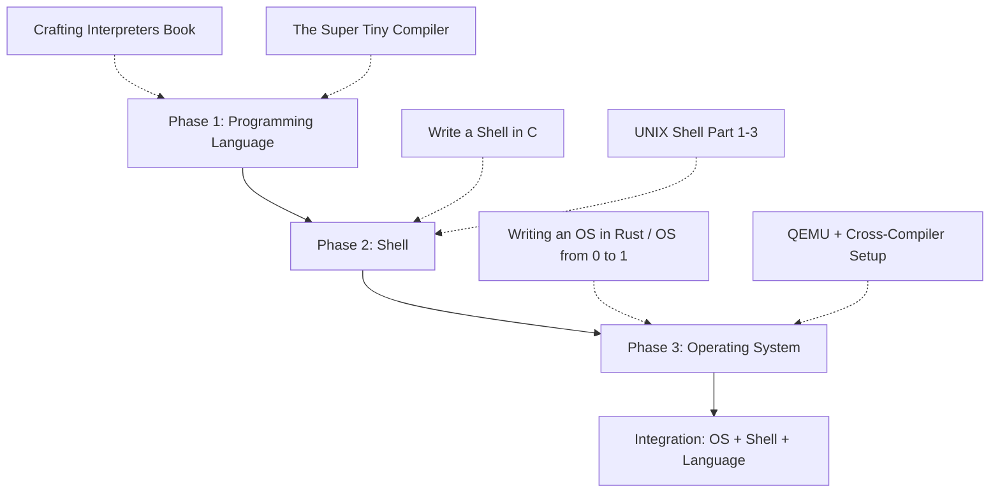

# Product Requirements Document (PRD): Build Your Own Stack

> **Project**: Custom Programming Language + Shell + Operating System
> **Source Reference**: [codecrafters-io/build-your-own-x](https://github.com/codecrafters-io/build-your-own-x)
> **Date**: 2026-03-03

---

## 1. Executive Summary

This project aims to build a **complete, vertically integrated computing stack** from scratch:

1. **A Custom Programming Language** — with lexer, parser, interpreter/compiler, and standard library
2. **A Custom Shell** — a UNIX-style command-line interface with piping, redirection, and job control
3. **A Custom Operating System** — with bootloader, kernel, memory management, process scheduler, and filesystem

The final deliverable is a bootable OS image (`.iso`) that launches into the custom shell, which can execute programs written in the custom language.

---

## 2. Goals & Objectives

### 2.1 Primary Goals

| # | Goal | Success Criteria |
|---|------|-----------------|
| G1 | Learn low-level systems programming | Complete all three layers end-to-end |
| G2 | Build a working programming language | Language passes a 50+ item test suite |
| G3 | Build a functional shell | Shell executes commands, supports piping and scripting |
| G4 | Build a bootable OS | Boots in QEMU/real hardware, runs shell + language |
| G5 | Create reusable documentation | All context survives IDE restarts via these docs |

### 2.2 Version Roadmap Overview

> Every feature is achievable — they are scoped into versions to ensure each release is **completable and usable**.

```
┌──────────┬─────────────────────────────────────────────────────────────────────┐
│ VERSION  │ THEME                                                             │
├──────────┼─────────────────────────────────────────────────────────────────────┤
│  v1.0    │ 🏗️  Foundation — Working language + shell + bootable OS (text mode) │
│  v2.0    │ ⚡ Performance — Bytecode compiler, optimizations, networking      │
│  v3.0    │ 🖥️  GUI — Framebuffer graphics, window manager, mouse support      │
│  v4.0    │ 🌐 Connected — Package manager, multi-user, security              │
│  v5.0    │ 🚀 Self-Hosting — OS compiles its own language, full POSIX shell   │
└──────────┴─────────────────────────────────────────────────────────────────────┘
```

---

### 2.3 Version Scopes (Detailed)

#### 🏗️ v1.0 — Foundation (Weeks 1–26)

**Theme**: Get the full stack working end-to-end in text mode.

| Layer | Features | Difficulty |
|-------|----------|------------|
| **Language** | Lexer, Parser, AST, Tree-walk Interpreter, REPL | ⭐⭐ |
| **Language** | Data types: int, float, string, bool, array | ⭐⭐ |
| **Language** | Variables, scoping, control flow (if/else/while/for) | ⭐⭐ |
| **Language** | Functions (declaration, params, return, recursion) | ⭐⭐ |
| **Language** | Basic standard library: print, input, len, type | ⭐⭐ |
| **Language** | Error messages with line/column info | ⭐⭐ |
| **Shell** | Command parsing, tokenization | ⭐⭐ |
| **Shell** | External command execution (fork/exec) | ⭐⭐ |
| **Shell** | Built-in commands: cd, pwd, echo, exit, help | ⭐⭐ |
| **Shell** | PATH resolution | ⭐ |
| **Shell** | I/O redirection (`>`, `>>`, `<`) | ⭐⭐ |
| **Shell** | Piping (`cmd1 \| cmd2`) | ⭐⭐ |
| **Shell** | Environment variables ($VAR, export) | ⭐⭐ |
| **Shell** | Signal handling (Ctrl+C) | ⭐⭐ |
| **OS** | x86 bootloader (Real → Protected mode) | ⭐⭐⭐ |
| **OS** | GDT, IDT setup | ⭐⭐⭐ |
| **OS** | VGA text mode driver (colored output, scrolling) | ⭐⭐ |
| **OS** | PS/2 keyboard driver | ⭐⭐ |
| **OS** | Physical memory manager (bitmap allocator) | ⭐⭐⭐ |
| **OS** | Virtual memory / paging | ⭐⭐⭐ |
| **OS** | Heap allocator (kmalloc/kfree) | ⭐⭐⭐ |
| **OS** | Timer driver (PIT) | ⭐⭐ |
| **OS** | Round-robin process scheduler | ⭐⭐⭐ |
| **OS** | Basic system calls: read, write, exit | ⭐⭐⭐ |
| **OS** | RAM-disk filesystem | ⭐⭐⭐ |
| **Integration** | OS boots → launches shell → runs language scripts | ⭐⭐⭐ |

**v1.0 Deliverable**: Bootable `.iso` image → boots in QEMU → shell prompt → run `.mypl` programs

---

#### ⚡ v2.0 — Performance & Networking (Weeks 27–40)

**Theme**: Make everything faster and add connectivity.

| Layer | Features | Difficulty |
|-------|----------|------------|
| **Language** | Bytecode compiler (AST → bytecode) | ⭐⭐⭐ |
| **Language** | Stack-based Virtual Machine | ⭐⭐⭐ |
| **Language** | Garbage collector (mark-and-sweep) | ⭐⭐⭐ |
| **Language** | Closures and first-class functions | ⭐⭐⭐ |
| **Language** | Import/module system | ⭐⭐ |
| **Language** | Hash maps / dictionaries | ⭐⭐ |
| **Language** | String interpolation (`f"Hello {name}"`) | ⭐⭐ |
| **Language** | Compiler optimizations: constant folding, dead code elimination | ⭐⭐⭐⭐ |
| **Shell** | Job control: bg, fg, jobs, `&` | ⭐⭐⭐ |
| **Shell** | Command history (up/down arrows, `history` command) | ⭐⭐ |
| **Shell** | Tab completion (commands + file paths) | ⭐⭐⭐ |
| **Shell** | Scripting: execute `.sh` script files | ⭐⭐ |
| **Shell** | Glob patterns: `*.txt`, `?` wildcards | ⭐⭐ |
| **Shell** | Aliases: `alias ll="ls -la"` | ⭐⭐ |
| **Shell** | Prompt customization (PS1) | ⭐ |
| **OS** | User mode (Ring 3) separation | ⭐⭐⭐⭐ |
| **OS** | ELF binary loader | ⭐⭐⭐ |
| **OS** | Proper FAT32 filesystem (on disk, not just RAM) | ⭐⭐⭐ |
| **OS** | Serial console (COM1 debug output) | ⭐⭐ |
| **OS** | NIC driver (e.g., RTL8139 / E1000) | ⭐⭐⭐⭐ |
| **OS** | ARP + IPv4 + UDP networking | ⭐⭐⭐⭐ |
| **OS** | TCP stack (basic) | ⭐⭐⭐⭐ |
| **OS** | Socket API for user-space programs | ⭐⭐⭐ |
| **OS** | Multi-processing (run multiple programs concurrently) | ⭐⭐⭐ |

**v2.0 Deliverable**: Programs run 10x faster on VM, OS can send/receive network packets, filesystem persists to disk

---

#### 🖥️ v3.0 — Graphical Interface (Weeks 41–56)

**Theme**: Move beyond text mode — build a graphical desktop environment.

| Layer | Features | Difficulty |
|-------|----------|------------|
| **Language** | Structs / classes with methods | ⭐⭐⭐ |
| **Language** | Error handling: try/catch exceptions | ⭐⭐⭐ |
| **Language** | Iterators and generators (`yield`) | ⭐⭐⭐ |
| **Language** | FFI (Foreign Function Interface) — call C from language | ⭐⭐⭐⭐ |
| **Language** | Standard library: file I/O, networking sockets | ⭐⭐⭐ |
| **Shell** | Syntax highlighting in REPL | ⭐⭐⭐ |
| **Shell** | Multi-line editing (here-docs, continuation) | ⭐⭐ |
| **Shell** | Configuration file (`.myshrc`) | ⭐⭐ |
| **OS** | VESA/VBE framebuffer driver (pixel graphics) | ⭐⭐⭐⭐ |
| **OS** | Mouse driver (PS/2 mouse) | ⭐⭐⭐ |
| **OS** | Font rendering (bitmap fonts on framebuffer) | ⭐⭐⭐ |
| **OS** | Window manager (compositing, z-ordering) | ⭐⭐⭐⭐⭐ |
| **OS** | Event system (keyboard + mouse events to windows) | ⭐⭐⭐⭐ |
| **OS** | Basic GUI widgets: buttons, text fields, scrollbars | ⭐⭐⭐⭐ |
| **OS** | Terminal emulator (run shell inside a GUI window) | ⭐⭐⭐⭐ |
| **OS** | Wallpaper and desktop icons | ⭐⭐⭐ |
| **OS** | GUI toolkit API for language programs | ⭐⭐⭐⭐ |

**v3.0 Deliverable**: OS boots into a graphical desktop with a terminal emulator window running the shell, mouse-clickable icons

---

#### 🌐 v4.0 — Connected & Secure (Weeks 57–72)

**Theme**: Multi-user, security, and a connected ecosystem.

| Layer | Features | Difficulty |
|-------|----------|------------|
| **Language** | Package manager: `mypl install <package>` | ⭐⭐⭐ |
| **Language** | Online package registry (hosted) | ⭐⭐⭐ |
| **Language** | Concurrency: threads / async-await | ⭐⭐⭐⭐ |
| **Language** | Type checker (static analysis, optional typing) | ⭐⭐⭐⭐ |
| **Language** | Debugger: breakpoints, step-through, variable inspection | ⭐⭐⭐⭐ |
| **Language** | LSP (Language Server Protocol) for IDE support | ⭐⭐⭐⭐ |
| **Shell** | Remote shell / SSH-like functionality | ⭐⭐⭐⭐ |
| **Shell** | Plugin system for shell extensions | ⭐⭐⭐ |
| **OS** | User accounts and login system | ⭐⭐⭐ |
| **OS** | File permissions (chmod/chown, rwx) | ⭐⭐⭐ |
| **OS** | Process isolation and memory protection | ⭐⭐⭐⭐ |
| **OS** | DHCP client (auto network configuration) | ⭐⭐⭐ |
| **OS** | DNS resolver | ⭐⭐⭐ |
| **OS** | HTTP client (fetch web pages) | ⭐⭐⭐ |
| **OS** | Shared libraries (.so dynamic loading) | ⭐⭐⭐⭐ |
| **OS** | IPC: pipes, shared memory, message queues | ⭐⭐⭐ |
| **OS** | Sound driver (basic audio output) | ⭐⭐⭐⭐ |

**v4.0 Deliverable**: Multi-user login, `mypl install` fetches packages from the internet, language has async/threading

---

#### 🚀 v5.0 — Self-Hosting & POSIX (Weeks 73–90+)

**Theme**: The ultimate goal — the system can build itself.

| Layer | Features | Difficulty |
|-------|----------|------------|
| **Language** | Native code compiler (LLVM backend or custom) | ⭐⭐⭐⭐⭐ |
| **Language** | Self-hosting compiler (compiler written in itself) | ⭐⭐⭐⭐⭐ |
| **Language** | Macro system / metaprogramming | ⭐⭐⭐⭐ |
| **Language** | Full standard library (comparable to Python stdlib) | ⭐⭐⭐⭐ |
| **Language** | Profiler and performance tooling | ⭐⭐⭐⭐ |
| **Shell** | POSIX compliance (sh-compatible) | ⭐⭐⭐⭐ |
| **Shell** | Programmable completion (bash-style) | ⭐⭐⭐ |
| **Shell** | Full arithmetic expansion | ⭐⭐⭐ |
| **OS** | POSIX-compatible syscall layer | ⭐⭐⭐⭐⭐ |
| **OS** | Multi-core / SMP support | ⭐⭐⭐⭐⭐ |
| **OS** | USB driver stack | ⭐⭐⭐⭐⭐ |
| **OS** | ext2/ext4-like filesystem | ⭐⭐⭐⭐ |
| **OS** | Port existing software (a C compiler like TCC) | ⭐⭐⭐⭐ |
| **OS** | UEFI boot support (alongside legacy BIOS) | ⭐⭐⭐⭐ |
| **OS** | Virtual filesystem (VFS) with mount points | ⭐⭐⭐⭐ |
| **OS** | x86_64 (64-bit) long mode support | ⭐⭐⭐⭐ |

**v5.0 Deliverable**: The OS can compile the language's compiler from source, fully self-contained computing environment

---

### 2.4 Version Comparison Matrix

| Feature Area | v1.0 🏗️ | v2.0 ⚡ | v3.0 🖥️ | v4.0 🌐 | v5.0 🚀 |
|-------------|---------|---------|---------|---------|----------|
| **Language: Interpreter** | ✅ Tree-walk | ✅ Bytecode VM | ✅ | ✅ | ✅ Native |
| **Language: Types** | int, float, str, bool, array | + dict/map | + structs/classes | + generics | Full type system |
| **Language: Functions** | Basic | + closures, modules | + iterators | + async/threads | + macros |
| **Language: Tooling** | REPL only | REPL + scripts | + syntax highlight | + debugger, LSP | + profiler |
| **Language: GC** | ❌ Manual | ✅ Mark-and-sweep | ✅ | ✅ Generational | ✅ Optimized |
| **Language: Compiler** | ❌ | ✅ Bytecode | ✅ + optimizations | ✅ | ✅ Native + self-host |
| **Shell: Commands** | Basic exec | + job control | + multi-line | + remote/SSH | POSIX sh |
| **Shell: Features** | Pipes, redirect | + tab complete, history | + syntax colors | + plugins | Full programmable |
| **OS: Display** | VGA text | VGA text | ✅ Framebuffer GUI | ✅ GUI + widgets | ✅ Full desktop |
| **OS: Input** | Keyboard | Keyboard | + Mouse | + Mouse | + USB |
| **OS: Memory** | Paging + heap | + user mode | ✅ | + protection | ✅ Full VMM |
| **OS: Processes** | Round-robin | + multi-process | ✅ | + isolation | SMP multi-core |
| **OS: Storage** | RAM disk | FAT32 on disk | ✅ | ✅ | ext2/ext4 |
| **OS: Network** | ❌ | ✅ TCP/IP basic | ✅ | + DHCP, DNS, HTTP | ✅ Full stack |
| **OS: Users** | Single user | Single user | Single user | ✅ Multi-user | ✅ + permissions |
| **OS: Boot** | BIOS/GRUB | ✅ | ✅ | ✅ | + UEFI |

---

## 3. Product Requirements

### 3.1 Programming Language Requirements

#### Functional Requirements

| ID | Requirement | Priority | Acceptance Criteria |
|----|-------------|----------|--------------------|
| PL-001 | **Lexer** tokenizes source into tokens | P0 | Handles identifiers, numbers, strings, operators, keywords |
| PL-002 | **Parser** produces valid AST | P0 | Parses expressions, statements, function declarations |
| PL-003 | **Data Types**: int, float, string, bool, array | P0 | Type inference or explicit typing works |
| PL-004 | **Variables**: declaration, assignment, scoping | P0 | Block-scoped variables, shadowing |
| PL-005 | **Operators**: arithmetic, comparison, logical | P0 | `+`, `-`, `*`, `/`, `%`, `==`, `!=`, `<`, `>`, `&&`, `\|\|` |
| PL-006 | **Control Flow**: if/else, while, for | P0 | Nested control flow works correctly |
| PL-007 | **Functions**: declaration, params, return | P0 | Recursive fibonacci computes correctly |
| PL-008 | **REPL**: interactive mode | P0 | Multi-line input, immediate evaluation |
| PL-009 | **Error Messages**: line/column info | P1 | `Error at line 5, col 12: unexpected token '}'` |
| PL-010 | **Standard Library**: print, input, len, type | P1 | Built-in functions for I/O and introspection |
| PL-011 | **String Operations**: concat, slice, format | P1 | String indexing and formatting |
| PL-012 | **Array/List Operations**: push, pop, map, filter | P1 | Higher-order functions on collections |
| PL-013 | **Import System**: module loading | P2 | `import math` loads a module file |
| PL-014 | **Closures**: capture outer variables | P2 | Closure captures lexical scope correctly |
| PL-015 | **Garbage Collector** | P2 | No memory leaks for long-running programs |
| PL-016 | **Bytecode Compiler + VM** | P2 | 10x faster than tree-walk interpreter |

#### Non-Functional Requirements

| ID | Requirement | Target |
|----|-------------|--------|
| PL-NF-001 | Tokenization speed | > 10,000 lines/sec |
| PL-NF-002 | Startup time (REPL) | < 100ms |
| PL-NF-003 | Error recovery | Parser continues after first error |
| PL-NF-004 | Test coverage | > 80% of language features |

---

### 3.2 Shell Requirements

#### Functional Requirements

| ID | Requirement | Priority | Acceptance Criteria |
|----|-------------|----------|--------------------|
| SH-001 | **Command Parsing**: tokenize input | P0 | Handles quoted strings, escapes |
| SH-002 | **External Commands**: execute via fork/exec | P0 | `ls`, `cat`, `grep` execute correctly |
| SH-003 | **Built-in Commands**: cd, pwd, echo, exit, help | P0 | `cd /tmp && pwd` prints `/tmp` |
| SH-004 | **PATH Resolution**: search PATH dirs | P0 | Finds executables in PATH |
| SH-005 | **Exit Codes**: capture and expose `$?` | P0 | `echo $?` shows last exit code |
| SH-006 | **I/O Redirection**: `>`, `>>`, `<` | P1 | `echo hello > file.txt` creates file |
| SH-007 | **Piping**: `cmd1 \| cmd2` | P1 | `ls \| grep .txt` filters output |
| SH-008 | **Environment Variables**: export, $VAR | P1 | `export FOO=bar && echo $FOO` → `bar` |
| SH-009 | **Signal Handling**: Ctrl+C, Ctrl+Z | P1 | Interrupt foreground process, not shell |
| SH-010 | **History**: up/down arrow recall | P1 | Previous commands accessible |
| SH-011 | **Job Control**: bg, fg, jobs, & | P2 | Background processes tracked |
| SH-012 | **Scripting**: execute script files | P2 | `#!/path/to/shell` shebang works |
| SH-013 | **Tab Completion**: commands and files | P2 | Tab expands partial commands/paths |
| SH-014 | **Custom Language Integration** | P2 | Shell can invoke custom language scripts |
| SH-015 | **Prompt Customization**: PS1 variable | P2 | User-configurable prompt string |
| SH-016 | **Glob Patterns**: `*.txt`, `?` wildcards | P2 | File globbing expands correctly |

#### Non-Functional Requirements

| ID | Requirement | Target |
|----|-------------|--------|
| SH-NF-001 | Input latency | < 10ms per keystroke |
| SH-NF-002 | Memory usage | < 5MB resident |
| SH-NF-003 | Stability | No crashes on malformed input |

---

### 3.3 Operating System Requirements

#### Functional Requirements

| ID | Requirement | Priority | Acceptance Criteria |
|----|-------------|----------|---------------------|
| OS-001 | **Bootloader**: BIOS/UEFI → kernel load | P0 | Boots in QEMU, prints to screen |
| OS-002 | **GDT Setup**: Global Descriptor Table | P0 | Protected mode enabled |
| OS-003 | **IDT Setup**: Interrupt Descriptor Table | P0 | Hardware interrupts handled |
| OS-004 | **VGA Text Mode**: print to screen | P0 | Colored text output, scrolling |
| OS-005 | **Keyboard Driver**: PS/2 input | P0 | Keypresses captured and displayed |
| OS-006 | **Physical Memory Manager** | P0 | Frame allocation/deallocation |
| OS-007 | **Virtual Memory / Paging** | P0 | Page tables set up, page faults handled |
| OS-008 | **Heap Allocator**: kmalloc/kfree | P0 | Dynamic memory allocation in kernel |
| OS-009 | **Timer Driver**: PIT/APIC | P1 | Periodic interrupts for scheduling |
| OS-010 | **Process Scheduler** | P1 | Round-robin context switching |
| OS-011 | **System Call Interface** | P1 | `read()`, `write()`, `exit()`, `fork()` |
| OS-012 | **Filesystem**: RAM disk or FAT | P1 | Create, read, write, delete files |
| OS-013 | **User Mode (Ring 3)** | P2 | User programs run in unprivileged mode |
| OS-014 | **ELF Loader** | P2 | Load and execute ELF binaries |
| OS-015 | **Shell Integration** | P2 | OS boots into custom shell |
| OS-016 | **Serial Console** | P2 | Debug output over COM1 |
| OS-017 | **Multi-processing** | P2 | Run multiple processes concurrently |

#### Non-Functional Requirements

| ID | Requirement | Target |
|----|-------------|--------|
| OS-NF-001 | Boot time | < 5 seconds in QEMU |
| OS-NF-002 | Memory support | Handle ≥ 16MB RAM |
| OS-NF-003 | Stability | No kernel panics on normal operations |
| OS-NF-004 | Target architecture | x86 (i686) or x86_64 |

---

## 4. User Stories

### Programming Language

| ID | User Story | Priority |
|----|-----------|----------|
| US-PL-01 | As a developer, I want to write and run a "Hello World" program | P0 |
| US-PL-02 | As a developer, I want to define functions with parameters and return values | P0 |
| US-PL-03 | As a developer, I want clear error messages when my code has bugs | P1 |
| US-PL-04 | As a developer, I want a REPL for quick experimentation | P0 |
| US-PL-05 | As a developer, I want to import code from other files | P2 |

### Shell

| ID | User Story | Priority |
|----|-----------|----------|
| US-SH-01 | As a user, I want to run programs by typing their name | P0 |
| US-SH-02 | As a user, I want to chain commands with pipes | P1 |
| US-SH-03 | As a user, I want to redirect output to files | P1 |
| US-SH-04 | As a user, I want to recall previous commands with arrow keys | P1 |
| US-SH-05 | As a user, I want to run custom language scripts from the shell | P2 |

### Operating System

| ID | User Story | Priority |
|----|-----------|----------|
| US-OS-01 | As a user, I want the OS to boot and show a welcome message | P0 |
| US-OS-02 | As a user, I want to type on the keyboard and see output | P0 |
| US-OS-03 | As a user, I want to run multiple programs at the same time | P1 |
| US-OS-04 | As a user, I want to save and load files | P1 |
| US-OS-05 | As a user, I want the OS to boot into my custom shell | P2 |

---

## 5. Dependencies & Prerequisites



### Technical Prerequisites

| Prerequisite | Required For | How to Get It |
|-------------|-------------|---------------|
| C/C++ proficiency | All phases | Practice with small projects |
| x86 Assembly basics | OS bootloader | Tutorials + reference manuals |
| Data structures (trees, stacks, queues) | Language parser | CS fundamentals |
| POSIX system calls | Shell | `man fork`, `man exec`, `man pipe` |
| Memory management concepts | OS, Language GC | OS textbook or tutorial |
| QEMU emulator | OS testing | `apt install qemu-system-x86` |
| GDB debugger | OS debugging | `apt install gdb` |
| NASM assembler | OS bootloader | `apt install nasm` |
| Cross-compiler (i686-elf-gcc) | OS kernel | Build from source or use package |

---

## 6. Testing Strategy

### 6.1 Programming Language

```
tests/
├── lexer/
│   ├── test_numbers.mypl
│   ├── test_strings.mypl
│   └── test_operators.mypl
├── parser/
│   ├── test_expressions.mypl
│   ├── test_functions.mypl
│   └── test_control_flow.mypl
├── interpreter/
│   ├── test_arithmetic.mypl
│   ├── test_variables.mypl
│   ├── test_fibonacci.mypl
│   └── test_closures.mypl
└── integration/
    ├── test_full_program.mypl
    └── test_error_handling.mypl
```

### 6.2 Shell

- **Unit tests**: Command parser, tokenizer, variable expansion
- **Integration tests**: Pipe chains, redirection, signal handling
- **Fuzzing**: Random input strings to test crash resistance

### 6.3 Operating System

- **QEMU automated tests**: Boot → check serial output
- **Memory tests**: Allocate/free patterns, detect leaks
- **Stress tests**: Fork bomb recovery, out-of-memory handling

---

## 7. Timeline & Resource Allocation

### Per-Version Timeline

| Version | Duration | Weeks | Cumulative | Key Focus |
|---------|----------|-------|------------|----------|
| **v1.0** 🏗️ Foundation | 26 weeks | 1–26 | 6 months | Language interpreter + Shell + Bootable OS |
| **v2.0** ⚡ Performance | 14 weeks | 27–40 | 10 months | Bytecode VM + GC + Networking + Disk FS |
| **v3.0** 🖥️ GUI | 16 weeks | 41–56 | 14 months | Framebuffer + Window Manager + Mouse |
| **v4.0** 🌐 Connected | 16 weeks | 57–72 | 18 months | Multi-user + Packages + Security |
| **v5.0** 🚀 Self-Hosting | 18+ weeks | 73–90+ | 22+ months | Native compiler + POSIX + SMP |

### v1.0 Internal Breakdown

| Phase | Duration | Effort | Key Tutorials |
|-------|----------|--------|---------------|
| Language: Lexer + Parser | 4 weeks | 25% | Crafting Interpreters, Super Tiny Compiler |
| Language: Interpreter + REPL + Stdlib | 4 weeks | 20% | Build Your Own Lisp, Let's Build An Interpreter |
| Shell: Core commands + pipes | 4 weeks | 15% | Write a Shell in C, UNIX Shell tutorial |
| OS: Bootloader + Kernel + Memory | 8 weeks | 25% | Writing an OS in Rust, OS From 0 to 1 |
| OS: Scheduler + Filesystem + Syscalls | 4 weeks | 10% | How to create an OS from scratch |
| Integration + Testing | 2 weeks | 5% | Custom integration work |
| **v1.0 Total** | **26 weeks** | **100%** | — |

---

> **Next**: See [mvptechdoc.md](./mvptechdoc.md) for technical details and [system_design.md](./system_design.md) for architecture deep-dive.
