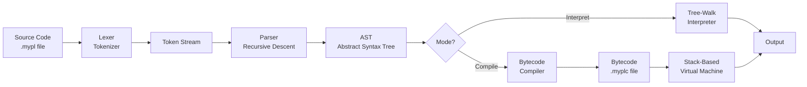
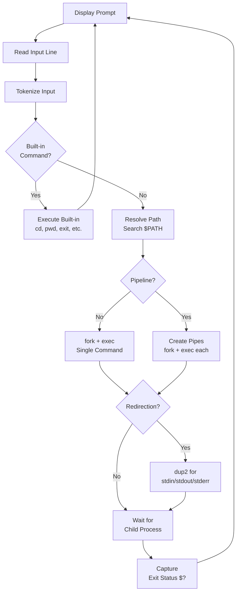
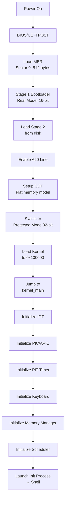

# System Design Document: Build Your Own Stack

> **Project**: Custom Programming Language + Shell + Operating System
> **Source Reference**: [codecrafters-io/build-your-own-x](https://github.com/codecrafters-io/build-your-own-x)
> **Date**: 2026-03-03

---

## 1. High-Level System Architecture

The complete stack consists of three layers, each building upon the one below.

```
╔══════════════════════════════════════════════════════════════════╗
║                        FULL STACK OVERVIEW                       ║
╠══════════════════════════════════════════════════════════════════╣
║                                                                  ║
║   ┌──────────────────────────────────────────────────────────┐   ║
║   │              CUSTOM PROGRAMMING LANGUAGE                 │   ║
║   │                                                          │   ║
║   │  Source → [Lexer] → [Parser] → [AST] → [Interpreter]    │   ║
║   │                                    └──→ [Compiler] → VM │   ║
║   │                                                          │   ║
║   │  Standard Library: I/O, Math, Strings, Collections       │   ║
║   └──────────────────────────┬───────────────────────────────┘   ║
║                              │ executes via                      ║
║   ┌──────────────────────────▼───────────────────────────────┐   ║
║   │                    CUSTOM SHELL                          │   ║
║   │                                                          │   ║
║   │  Input → [Lexer] → [Parser] → [Executor]                │   ║
║   │                                    │                     │   ║
║   │  Built-ins: cd, pwd, echo, exit    │                     │   ║
║   │  Features: pipes, redirection,     │                     │   ║
║   │            env vars, job control   │                     │   ║
║   └──────────────────────────┬─────────┘                     │   ║
║                              │ runs on                           ║
║   ┌──────────────────────────▼───────────────────────────────┐   ║
║   │                   CUSTOM OS KERNEL                       │   ║
║   │                                                          │   ║
║   │  ┌──────────┐ ┌──────────┐ ┌──────────┐ ┌────────────┐  │   ║
║   │  │Bootloader│ │ Memory   │ │ Process  │ │ Filesystem │  │   ║
║   │  │          │ │ Manager  │ │Scheduler │ │            │  │   ║
║   │  └──────────┘ └──────────┘ └──────────┘ └────────────┘  │   ║
║   │  ┌──────────┐ ┌──────────┐ ┌──────────┐ ┌────────────┐  │   ║
║   │  │  VGA     │ │ Keyboard │ │  Timer   │ │  Syscall   │  │   ║
║   │  │ Driver   │ │  Driver  │ │  (PIT)   │ │ Interface  │  │   ║
║   │  └──────────┘ └──────────┘ └──────────┘ └────────────┘  │   ║
║   └──────────────────────────────────────────────────────────┘   ║
║                              ▲                                   ║
║                          HARDWARE                                ║
║                    (x86/x86_64 or ARM)                           ║
╚══════════════════════════════════════════════════════════════════╝
```

---

## 2. Component Design: Programming Language

### 2.1 Compilation Pipeline



### 2.2 Lexer Design

The lexer scans source code character by character, producing a stream of tokens.

**Token Types:**

```
TOKEN_INT_LITERAL    = "42"
TOKEN_FLOAT_LITERAL  = "3.14"
TOKEN_STRING_LITERAL = "\"hello\""
TOKEN_IDENTIFIER     = "myVar"
TOKEN_KEYWORD        = "fn" | "let" | "if" | "else" | "while" | "for" | "return" | "true" | "false"
TOKEN_OPERATOR       = "+" | "-" | "*" | "/" | "%" | "==" | "!=" | "<" | ">" | "&&" | "||"
TOKEN_ASSIGN         = "="
TOKEN_LPAREN         = "("
TOKEN_RPAREN         = ")"
TOKEN_LBRACE         = "{"
TOKEN_RBRACE         = "}"
TOKEN_SEMICOLON      = ";"
TOKEN_COMMA          = ","
TOKEN_COLON          = ":"
TOKEN_ARROW          = "->"
TOKEN_EOF            = end-of-file
```

**Lexer State Machine:**

```
┌─────────┐   digit    ┌──────────────┐
│  START  │───────────▶│ READ_NUMBER  │───▶ emit TOKEN_INT/FLOAT
│         │            └──────────────┘
│         │   alpha    ┌──────────────┐
│         │───────────▶│  READ_IDENT  │───▶ emit TOKEN_IDENT or TOKEN_KEYWORD
│         │            └──────────────┘
│         │    "       ┌──────────────┐
│         │───────────▶│ READ_STRING  │───▶ emit TOKEN_STRING
│         │            └──────────────┘
│         │   op_char  ┌──────────────┐
│         │───────────▶│  READ_OP     │───▶ emit TOKEN_OPERATOR
│         │            └──────────────┘
│         │   space/\n
│         │───────────▶ skip, stay in START
└─────────┘
```

### 2.3 Parser Design (Recursive Descent)

**Grammar (EBNF):**

```ebnf
program        = { statement } ;
statement      = let_stmt | fn_stmt | if_stmt | while_stmt | for_stmt
               | return_stmt | expr_stmt ;
let_stmt       = "let" IDENT [ ":" type ] "=" expression ";" ;
fn_stmt        = "fn" IDENT "(" params ")" [ "->" type ] block ;
if_stmt        = "if" expression block [ "else" block ] ;
while_stmt     = "while" expression block ;
for_stmt       = "for" IDENT "in" expression block ;
return_stmt    = "return" [ expression ] ";" ;
expr_stmt      = expression ";" ;
block          = "{" { statement } "}" ;

expression     = assignment ;
assignment     = IDENT "=" assignment | logic_or ;
logic_or       = logic_and { "||" logic_and } ;
logic_and      = equality { "&&" equality } ;
equality       = comparison { ("==" | "!=") comparison } ;
comparison     = addition { ("<" | ">" | "<=" | ">=") addition } ;
addition       = multiplication { ("+" | "-") multiplication } ;
multiplication = unary { ("*" | "/" | "%") unary } ;
unary          = ("!" | "-") unary | call ;
call           = primary { "(" arguments ")" | "[" expression "]" } ;
primary        = INT | FLOAT | STRING | "true" | "false" | IDENT | "(" expression ")" ;

type           = "int" | "float" | "string" | "bool" | "[" type "]" ;
params         = [ IDENT ":" type { "," IDENT ":" type } ] ;
arguments      = [ expression { "," expression } ] ;
```

### 2.4 AST Node Types

```
Program
├── FnDeclaration { name, params, return_type, body }
├── LetStatement { name, type_hint, initializer }
├── IfStatement { condition, then_branch, else_branch }
├── WhileStatement { condition, body }
├── ForStatement { variable, iterable, body }
├── ReturnStatement { value }
├── ExpressionStatement { expression }
│
├── BinaryExpr { left, operator, right }
├── UnaryExpr { operator, operand }
├── CallExpr { callee, arguments }
├── IndexExpr { object, index }
├── AssignExpr { name, value }
├── LiteralExpr { value: int|float|string|bool }
├── IdentifierExpr { name }
└── BlockExpr { statements }
```

### 2.5 Interpreter Environment

```
┌─────────────────────────────────────┐
│         GLOBAL ENVIRONMENT          │
│  print → <builtin_fn>              │
│  input → <builtin_fn>              │
│  len   → <builtin_fn>              │
│  x     → 42                        │
│  ┌─────────────────────────────┐    │
│  │   FUNCTION ENVIRONMENT      │    │
│  │   (parent: GLOBAL)          │    │
│  │   a → 10                    │    │
│  │   b → 20                    │    │
│  │   ┌─────────────────────┐   │    │
│  │   │  BLOCK ENVIRONMENT  │   │    │
│  │   │  (parent: FUNCTION) │   │    │
│  │   │  temp → 30          │   │    │
│  │   └─────────────────────┘   │    │
│  └─────────────────────────────┘    │
└─────────────────────────────────────┘
```

### 2.6 Virtual Machine Design (Bytecode)

**Stack-Based VM Instruction Set:**

| Opcode | Description | Stack Effect |
|--------|-------------|-------------|
| `OP_CONST i` | Push constant[i] onto stack | → value |
| `OP_ADD` | Pop two, push sum | a, b → (a+b) |
| `OP_SUB` | Pop two, push difference | a, b → (a-b) |
| `OP_MUL` | Pop two, push product | a, b → (a*b) |
| `OP_DIV` | Pop two, push quotient | a, b → (a/b) |
| `OP_NEG` | Negate top of stack | a → (-a) |
| `OP_NOT` | Logical NOT | a → (!a) |
| `OP_EQ` | Equality check | a, b → (a==b) |
| `OP_LT` | Less than | a, b → (a<b) |
| `OP_GT` | Greater than | a, b → (a>b) |
| `OP_LOAD name` | Load variable | → value |
| `OP_STORE name` | Store variable | value → |
| `OP_JMP offset` | Unconditional jump | — |
| `OP_JMP_IF_FALSE offset` | Jump if TOS is false | value → |
| `OP_CALL argc` | Call function | fn, args → result |
| `OP_RETURN` | Return from function | value → |
| `OP_PRINT` | Print TOS | value → |
| `OP_POP` | Discard TOS | value → |
| `OP_HALT` | Stop execution | — |

**Example Compilation:**

```
Source:  let x = 2 + 3 * 4

Bytecode:
  OP_CONST 2    // push 2
  OP_CONST 3    // push 3
  OP_CONST 4    // push 4
  OP_MUL        // 3 * 4 = 12
  OP_ADD        // 2 + 12 = 14
  OP_STORE "x"  // x = 14
```

---

## 3. Component Design: Shell

### 3.1 Shell Execution Flow



### 3.2 Data Structures

```c
// Token types for shell input
typedef enum {
    TOK_WORD,       // command or argument
    TOK_PIPE,       // |
    TOK_REDIR_IN,   // <
    TOK_REDIR_OUT,  // >
    TOK_REDIR_APP,  // >>
    TOK_BACKGROUND, // &
    TOK_SEMICOLON,  // ;
    TOK_AND,        // &&
    TOK_OR,         // ||
    TOK_NEWLINE,
    TOK_EOF
} TokenType;

// Parsed command structure
typedef struct Command {
    char **argv;            // NULL-terminated argument array
    char *input_file;       // < redirection
    char *output_file;      // > or >> redirection
    int append_mode;        // 1 if >>, 0 if >
    int background;         // 1 if &
    struct Command *next;   // next command in pipeline
} Command;
```

### 3.3 Process Management

```
Shell Process (PID: 1000)
│
├── fork() ──▶ Child 1 (PID: 1001)
│                 │
│                 ├── Set up redirections (dup2)
│                 ├── Set up pipe ends
│                 └── execvp("ls", ["ls", "-la", NULL])
│
├── fork() ──▶ Child 2 (PID: 1002)   ← piped from Child 1
│                 │
│                 ├── Read from pipe fd
│                 └── execvp("grep", ["grep", ".txt", NULL])
│
├── waitpid(1001, &status, 0)
├── waitpid(1002, &status, 0)
└── $? = WEXITSTATUS(status)
```

### 3.4 Built-in Commands Implementation

| Command | Implementation | Notes |
|---------|---------------|-------|
| `cd <dir>` | `chdir(dir)` | Updates `$PWD`, handles `~`, `-` |
| `pwd` | `getcwd()` | Prints current working directory |
| `echo <args>` | `write(1, args)` | Handles `-n`, escape sequences |
| `exit [code]` | `exit(code)` | Default code 0 |
| `export VAR=val` | `setenv(var, val)` | Updates environment |
| `unset VAR` | `unsetenv(var)` | Removes env variable |
| `history` | Read history file | Display past commands |
| `help` | Print built-in list | Show available commands |
| `source <file>` | Read and execute file | Run script in current shell |
| `type <cmd>` | Resolve command | Show if built-in or path |

---

## 4. Component Design: Operating System

### 4.1 Boot Sequence



### 4.2 Memory Layout

```
┌────────────────────────────┐ 0xFFFFFFFF (4 GB)
│                            │
│    Kernel Virtual Space    │
│    (Page tables, kernel    │
│     heap, kernel stacks)   │
│                            │
├────────────────────────────┤ 0xC0000000 (3 GB) ← Kernel base (higher-half)
│                            │
│                            │
│    User Virtual Space      │
│    (User code, data,       │
│     heap, stack)           │
│                            │
├────────────────────────────┤ 0x00400000 (4 MB) ← User program load address
│    Reserved / Low Memory   │
├────────────────────────────┤ 0x00100000 (1 MB) ← Kernel physical load
│    BIOS / VGA / ROM        │
├────────────────────────────┤ 0x000B8000 ← VGA text buffer
│    Low memory / IVT / BDA  │
└────────────────────────────┘ 0x00000000
```

### 4.3 Physical Memory Manager

**Bitmap Allocator:**

```
Physical Memory:  [Frame 0][Frame 1][Frame 2][Frame 3][Frame 4]...
Frame Size:       4096 bytes (4 KB)

Bitmap:           [1][1][0][0][1][0][0][0]...
                   ▲  ▲  ▲  ▲  ▲
                   │  │  │  │  └── allocated (kernel)
                   │  │  │  └───── free
                   │  │  └──────── free
                   │  └─────────── allocated (BIOS)
                   └────────────── allocated (bootloader)

API:
  frame_alloc()     → returns physical address of free frame
  frame_free(addr)  → marks frame as available
  frame_count()     → total physical frames
  frame_used()      → allocated frame count
```

### 4.4 Virtual Memory / Paging

```
┌──────────────────────────────────────────────────────────────┐
│                    Page Directory (PD)                        │
│  Entry 0:   → Page Table 0   (maps 0x00000000 - 0x003FFFFF) │
│  Entry 1:   → Page Table 1   (maps 0x00400000 - 0x007FFFFF) │
│  ...                                                         │
│  Entry 768: → Page Table 768 (maps 0xC0000000 - 0xC03FFFFF) │
│  Entry 1023:→ Page Directory (recursive mapping)             │
└──────────────────────────────────────────────────────────────┘
         │
         ▼
┌──────────────────────────────────────────────────────────────┐
│                    Page Table (PT)                            │
│  Entry 0:   → Physical Frame at 0x00000000, flags: P|RW     │
│  Entry 1:   → Physical Frame at 0x00001000, flags: P|RW     │
│  Entry 2:   → Not Present                                   │
│  ...                                                         │
│  Entry 1023:→ Physical Frame at 0x003FF000, flags: P|RW|US  │
└──────────────────────────────────────────────────────────────┘

Virtual Address Translation:
  Virtual: [PD Index: 10 bits][PT Index: 10 bits][Offset: 12 bits]
  
  Example: 0xC0001234
    PD Index: 768 (0x300)  → Points to kernel page table
    PT Index: 1            → Points to frame at physical 0x00101000
    Offset:   0x234        → Physical address: 0x00101234
```

### 4.5 Process Control Block (PCB)

```c
typedef enum {
    PROCESS_READY,
    PROCESS_RUNNING,
    PROCESS_BLOCKED,
    PROCESS_TERMINATED
} ProcessState;

typedef struct {
    uint32_t eax, ebx, ecx, edx;
    uint32_t esi, edi, ebp, esp;
    uint32_t eip, eflags;
    uint32_t cs, ds, es, fs, gs, ss;
    uint32_t cr3;  // page directory
} CPUState;

typedef struct Process {
    uint32_t       pid;
    char           name[64];
    ProcessState   state;
    CPUState       cpu_state;
    uint32_t       *page_directory;
    uint32_t       kernel_stack;
    uint32_t       user_stack;
    int            priority;
    struct Process *parent;
    struct Process *next;  // linked list for scheduler
} Process;
```

### 4.6 Scheduler Design (Round-Robin)

```
Ready Queue:  [P1] → [P2] → [P3] → [P1] → ...
                ▲                      │
                └──────────────────────┘

Timer Interrupt (every ~10ms):
  1. Save current process CPU state → PCB
  2. Move current process to end of ready queue
  3. Pick next process from front of ready queue
  4. Load new process CPU state from PCB
  5. Switch page directory (CR3)
  6. iret → resume new process
```

### 4.7 System Call Interface

```
User Space                    Kernel Space
───────────                   ────────────
write(fd, buf, len)
    │
    ├── EAX = SYS_WRITE (1)
    ├── EBX = fd
    ├── ECX = buf pointer
    ├── EDX = len
    │
    ├── INT 0x80  ─────────▶  syscall_handler:
    │                            ├── save registers
    │                            ├── lookup syscall table[EAX]
    │                            ├── call sys_write(EBX, ECX, EDX)
    │                            ├── put return value in EAX
    │                            └── iret
    │
    ◀── EAX = bytes_written
```

**Syscall Table:**

| Number | Name | Arguments | Description |
|--------|------|-----------|-------------|
| 0 | `sys_read` | fd, buf, count | Read from file descriptor |
| 1 | `sys_write` | fd, buf, count | Write to file descriptor |
| 2 | `sys_open` | path, flags | Open a file |
| 3 | `sys_close` | fd | Close file descriptor |
| 4 | `sys_fork` | — | Create child process |
| 5 | `sys_exec` | path, argv | Execute a program |
| 6 | `sys_exit` | status | Terminate process |
| 7 | `sys_waitpid` | pid, status | Wait for child process |
| 8 | `sys_getpid` | — | Get current process ID |
| 9 | `sys_sbrk` | increment | Grow heap |

### 4.8 Filesystem Design (Simple FAT-like)

```
┌──────────────────────────────────────────────────────┐
│                     DISK LAYOUT                       │
├──────────┬──────────┬──────────┬─────────────────────┤
│ Boot     │ Super    │ File     │                     │
│ Sector   │ Block    │ Alloc    │  Data Blocks        │
│ (512B)   │ (512B)   │ Table    │  (4KB each)         │
│          │          │ (FAT)    │                     │
└──────────┴──────────┴──────────┴─────────────────────┘

Super Block:
  magic:          0xDEADBEEF
  total_blocks:   1024
  fat_start:      2
  fat_size:       8 blocks
  data_start:     10
  root_dir_block: 10

Directory Entry (32 bytes):
  name:       [24 bytes]  filename (null-terminated)
  flags:      [1 byte]    directory / file / deleted
  start_block:[2 bytes]   first data block
  size:       [4 bytes]   file size in bytes
  reserved:   [1 byte]

FAT Entry:
  0x0000 = free block
  0xFFFF = end of chain
  other  = next block number
```

---

## 5. Integration Architecture

### 5.1 How the Three Layers Connect

```
╔══════════════════════════════════════════════════════════════╗
║  USER INTERACTION FLOW                                       ║
║                                                              ║
║  1. OS boots → loads kernel → initializes subsystems         ║
║  2. Kernel launches init process → starts Shell              ║
║  3. User types: ./program.mypl                               ║
║  4. Shell:                                                   ║
║     a. Tokenizes input                                       ║
║     b. Resolves "./program.mypl" via PATH                    ║
║     c. Calls sys_fork() → new process                        ║
║     d. Child calls sys_exec("mypl_interpreter", args)        ║
║  5. Language Runtime:                                        ║
║     a. Reads program.mypl via sys_read()                     ║
║     b. Lexer → Parser → AST → Interpreter                   ║
║     c. print() calls → sys_write(STDOUT)                     ║
║     d. Exits via sys_exit()                                  ║
║  6. Shell: waitpid() returns, shows next prompt              ║
╚══════════════════════════════════════════════════════════════╝
```

### 5.2 Interface Contracts

```
┌─────────────────────┐     syscalls      ┌─────────────────────┐
│                     │◄─────────────────▶│                     │
│  Language Runtime   │  sys_read()       │     OS Kernel       │
│  Shell              │  sys_write()      │                     │
│                     │  sys_fork()       │  Provides:          │
│  Requires:          │  sys_exec()       │  - Process mgmt     │
│  - File I/O         │  sys_exit()       │  - Memory mgmt      │
│  - Process control  │  sys_open()       │  - File I/O         │
│  - Memory alloc     │  sys_close()      │  - Device access     │
│  - Console I/O      │  sys_sbrk()       │                     │
│                     │  sys_waitpid()    │                     │
└─────────────────────┘                   └─────────────────────┘
```

---

## 6. File Structure (Recommended)

```
build-your-own-stack/
├── docs/
│   ├── mvptechdoc.md          ← MVP Technical Documentation
│   ├── prd.md                 ← Product Requirements Document
│   └── system_design.md       ← This file
│
├── language/                   ← Custom Programming Language
│   ├── src/
│   │   ├── lexer.c            ← Tokenizer
│   │   ├── lexer.h
│   │   ├── parser.c           ← Recursive descent parser
│   │   ├── parser.h
│   │   ├── ast.c              ← AST node types
│   │   ├── ast.h
│   │   ├── interpreter.c      ← Tree-walk interpreter
│   │   ├── interpreter.h
│   │   ├── environment.c      ← Variable scoping
│   │   ├── environment.h
│   │   ├── compiler.c         ← Bytecode compiler (Phase 2)
│   │   ├── vm.c               ← Stack-based VM (Phase 2)
│   │   ├── gc.c               ← Garbage collector (Phase 2)
│   │   ├── stdlib.c           ← Built-in functions
│   │   ├── repl.c             ← REPL loop
│   │   └── main.c             ← Entry point
│   ├── tests/
│   │   ├── test_lexer.c
│   │   ├── test_parser.c
│   │   ├── test_interpreter.c
│   │   └── programs/          ← Test .mypl programs
│   ├── examples/
│   │   ├── hello.mypl
│   │   ├── fibonacci.mypl
│   │   └── sorting.mypl
│   └── Makefile
│
├── shell/                      ← Custom Shell
│   ├── src/
│   │   ├── main.c             ← Shell entry point + REPL
│   │   ├── lexer.c            ← Input tokenizer
│   │   ├── parser.c           ← Command parser
│   │   ├── executor.c         ← fork/exec/pipe/redirect
│   │   ├── builtins.c         ← cd, pwd, echo, etc.
│   │   ├── environment.c      ← Env variable management
│   │   ├── history.c          ← Command history
│   │   ├── signals.c          ← Signal handling
│   │   ├── job_control.c      ← Background jobs
│   │   └── completion.c       ← Tab completion
│   ├── tests/
│   │   ├── test_parser.c
│   │   └── test_builtins.c
│   └── Makefile
│
├── os/                         ← Custom Operating System
│   ├── boot/
│   │   ├── boot.asm           ← Stage 1 bootloader (512 bytes)
│   │   ├── boot2.asm          ← Stage 2 bootloader
│   │   └── gdt.asm            ← GDT setup
│   ├── kernel/
│   │   ├── kernel.c           ← kernel_main entry
│   │   ├── idt.c              ← Interrupt descriptor table
│   │   ├── isr.c              ← Interrupt service routines
│   │   ├── isr.asm            ← ISR stubs (asm)
│   │   ├── pic.c              ← Programmable interrupt controller
│   │   ├── timer.c            ← PIT timer driver
│   │   ├── keyboard.c         ← PS/2 keyboard driver
│   │   └── syscall.c          ← System call handler
│   ├── mm/
│   │   ├── pmm.c              ← Physical memory manager
│   │   ├── vmm.c              ← Virtual memory / paging
│   │   └── heap.c             ← Kernel heap allocator
│   ├── proc/
│   │   ├── process.c          ← Process management
│   │   ├── scheduler.c        ← Round-robin scheduler
│   │   └── context_switch.asm ← Context switching (asm)
│   ├── fs/
│   │   ├── vfs.c              ← Virtual filesystem layer
│   │   ├── fat.c              ← FAT filesystem driver
│   │   └── ramfs.c            ← RAM filesystem
│   ├── drivers/
│   │   ├── vga.c              ← VGA text mode driver
│   │   ├── serial.c           ← Serial port (COM1) driver
│   │   └── ata.c              ← ATA disk driver
│   ├── include/
│   │   ├── types.h            ← uint8_t, uint32_t, etc.
│   │   ├── multiboot.h        ← Multiboot header
│   │   └── *.h                ← Header files
│   ├── linker.ld              ← Linker script
│   ├── Makefile
│   └── grub.cfg               ← GRUB configuration
│
├── tools/
│   ├── run_qemu.sh            ← Launch OS in QEMU
│   ├── debug_gdb.sh           ← GDB debugging session
│   └── create_iso.sh          ← Build bootable ISO
│
├── Makefile                    ← Top-level build
├── mvptechdoc.md
├── prd.md
└── system_design.md
```

---

## 7. Build & Run Commands

```bash
# Build the programming language
cd language && make

# Run the REPL
./language/bin/mypl

# Run a program file
./language/bin/mypl examples/fibonacci.mypl

# Build the shell
cd shell && make

# Run the shell
./shell/bin/mysh

# Build the OS kernel
cd os && make

# Create bootable ISO
cd os && make iso

# Run in QEMU
qemu-system-i386 -cdrom os/myos.iso -m 32M

# Debug with GDB
qemu-system-i386 -cdrom os/myos.iso -s -S &
gdb -ex "target remote :1234" -ex "symbol-file os/kernel.elf"
```

---

## 8. Key Design Decisions

| Decision | Choice | Rationale |
|----------|--------|-----------|
| Language paradigm | Multi-paradigm (imperative + functional) | Flexible for learning |
| Interpreter first, compiler second | Tree-walk → bytecode VM | Easier to debug, iterate |
| Shell implementation language | C | Direct syscall access |
| OS target architecture | x86 (i686) | Most tutorial support |
| OS bootloader | GRUB (Multiboot) | Handles protected mode transition |
| Memory model | Higher-half kernel (3GB/1GB split) | Standard Linux-like layout |
| Filesystem | Simple FAT-like on ramdisk | Minimizes disk driver complexity |
| Process scheduling | Round-robin with priorities | Simple, fair, well-understood |
| Testing | QEMU + serial output + GDB | Fast iteration, full debugging |

---

> **Companion Documents**: [mvptechdoc.md](./mvptechdoc.md) • [prd.md](./prd.md)
