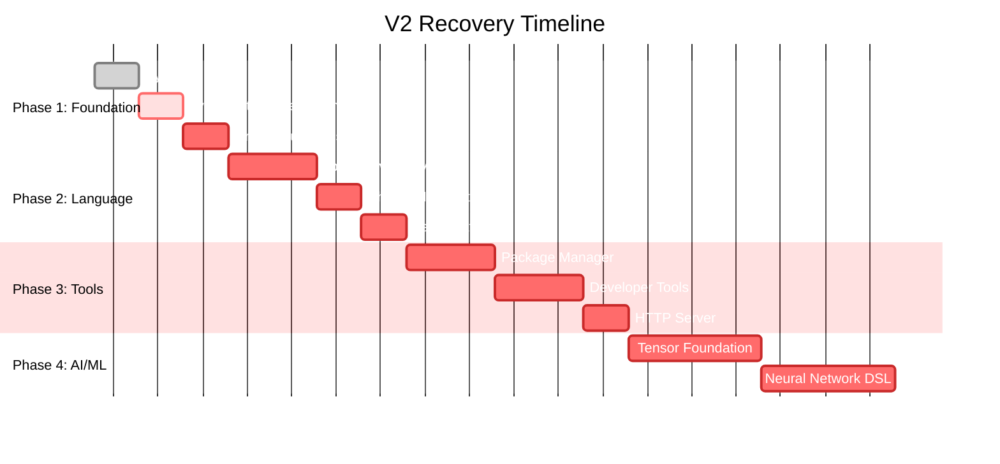

# Vexium V2 Recovery Plan & Architecture Design

**Document Type:** Technical Recovery Plan & Architecture Specification  
**Date:** 2026-03-05  
**Status:** Critical Recovery Required  
**Actual Completion:** ~50% (claimed 85%)

---

## Table of Contents

1. [Executive Summary](#executive-summary)
2. [Root Cause Analysis: Building Mistakes](#root-cause-analysis-building-mistakes)
3. [Recovery Strategy Overview](#recovery-strategy-overview)
4. [Phase 1: Foundation Repair (P0)](#phase-1-foundation-repair-p0)
5. [Phase 2: Language Integration (P1)](#phase-2-language-integration-p1)
6. [Phase 3: Feature Completion (P2)](#phase-3-feature-completion-p2)
7. [Phase 4: Differentiating Features (P3)](#phase-4-differentiating-features-p3)
8. [Architecture Designs](#architecture-designs)
9. [Implementation Roadmap](#implementation-roadmap)
10. [Testing Strategy](#testing-strategy)

---

## Executive Summary

This document provides a comprehensive recovery plan to address the ~35% gap between claimed and actual V2 implementation. The plan is structured in 4 phases over 16-20 weeks, prioritizing production blockers first, then core language promises, then differentiating features.

### Recovery Timeline

| Phase | Duration | Focus | Deliverable |
|-------|----------|-------|-------------|
| Phase 1 | 3-4 weeks | Production Blockers | Stable, usable V2 base |
| Phase 2 | 4-5 weeks | Core Promises | Concurrency + Type System |
| Phase 3 | 4-6 weeks | Feature Completion | Package Manager + Tools |
| Phase 4 | 5-6 weeks | Differentiation | AI/ML Foundation |
| **Total** | **16-20 weeks** | **Full Recovery** | **Production-Ready V2** |

---

## Root Cause Analysis: Building Mistakes

### Mistake #1: Bottom-Up Without Top-Down Integration

**What Happened:**
- Built excellent C-level infrastructure (task system, type inference engine)
- Never connected these to the language frontend
- Result: C code exists but users can't access it

**Example:**
```c
// task.c - Beautiful C implementation
void task_spawn(Task* task);  // Works perfectly in C
Value task_await(Task* task); // Full implementation

// But in the language:
// spawn my_task();  // ERROR: "spawn" not recognized
// await result;     // ERROR: "await" not recognized
```

**Why It Happened:**
- Focused on "hard" systems programming (C code, VM, GC)
- Neglected "easy" language frontend integration
- Assumed connecting them would be trivial

**The Fix:**
- Language-first integration approach
- Every C feature must have: Token → AST Node → Compiler → VM Opcode
- No C code without language exposure

---

### Mistake #2: Premature Optimization Over Completeness

**What Happened:**
- Built bytecode caching before fixing string corruption
- Implemented complex type inference but didn't connect it
- Created thread pools but no `spawn` keyword

**Example:**
```c
// bytecode_cache.c - Complex caching system
// BUT: Corrupts all strings on load
// Result: Feature that actively breaks user code
```

**Why It Happened:**
- Optimized for performance before correctness
- "Cache makes it faster" seemed more impressive than "it works correctly"
- Didn't test edge cases (string reconstruction)

**The Fix:**
- Correctness before performance
- Disable caching until string bug fixed
- Test round-trip: source → bytecode → cache → load → execute

---

### Mistake #3: Documentation-Driven Development

**What Happened:**
- Wrote extensive specs for AI/ML features
- Created beautiful examples showing `neural network:` DSL
- Implemented 0% of the actual AI/ML code

**Example:**
```markdown
# language_v2_spec.md
"Vex has native GPU support:
@gpu fn double_elements(data: tensor) -> tensor"

# reality:
$ grep -r "tensor\|@gpu" vex/src/
# (no results)
```

**Why It Happened:**
- Spec writing is easier than implementation
- "Vision" was documented before feasibility was proven
- Marketing got ahead of engineering

**The Fix:**
- Working code before documentation
- Remove or mark as "planned" all unimplemented features
- Honest status tracking

---

### Mistake #4: Monolithic Integration Testing

**What Happened:**
- Tested components in isolation (lexer works, parser works, VM works)
- Never tested full pipeline: source → tokens → AST → bytecode → execution
- Integration bugs (like string cache corruption) discovered late

**Example:**
```c
// Each component tested individually:
// lexer_test: ✅ passes
// parser_test: ✅ passes  
// vm_test: ✅ passes
// BUT:
// source → bytecode → cache → load: ❌ FAILS (strings corrupted)
```

**Why It Happened:**
- Unit testing is easier than integration testing
- Didn't have end-to-end test suite
- Assumed components would compose correctly

**The Fix:**
- End-to-end tests for every feature
- Integration tests before claiming completion
- Automated test suite running on every build

---

### Mistake #5: Scope Creep Without Prioritization

**What Happened:**
- Added AI/ML to V2 scope mid-development
- Didn't cut features when falling behind
- Result: 50% done on everything, 100% done on nothing

**Example:**
```markdown
# V2_COMPLETION_ROADMAP.md claims:
- Bytecode VM: 100% ✅
- Type System: 90% 🟡
- Concurrency: 20% 🟡
- AI/ML: "planned" 🔴

# Reality:
- VM has critical string bug
- Type system not connected
- Concurrency has C code, no language support
- AI/ML: 0%
```

**Why It Happened:**
- Wanted to match Python's ecosystem in one release
- Didn't want to admit features needed to move to V3
- Pressure to deliver "revolutionary" features

**The Fix:**
- Ruthless prioritization
- Cut AI/ML from V2, move to V3
- Focus on "concurrency + types + package manager" as V2 scope

---

## Recovery Strategy Overview

### Guiding Principles

1. **Correctness Over Features:** Fix bugs before adding features
2. **Integration Over Isolation:** Connect existing code before writing new code
3. **Honest Communication:** Document actual status, not aspirational status
4. **User-First:** Enable user-facing features (keywords, commands) before internals

### Recovery Approach

```
┌─────────────────────────────────────────────────────────────────┐
│                    RECOVERY FLOW                                │
├─────────────────────────────────────────────────────────────────┤
│                                                                 │
│  CURRENT STATE                          TARGET STATE            │
│  ┌──────────────┐                       ┌──────────────┐       │
│  │   Isolated   │  1. Connect Type Sys  │  Integrated  │       │
│  │ Components   │ ────────────────────> │   System     │       │
│  │   (50%)      │                       │   (100%)     │       │
│  └──────────────┘                       └──────────────┘       │
│          │                                      │              │
│          │ 2. Fix Critical Bugs                   │              │
│          v                                      v              │
│  ┌──────────────┐  3. Add Language    ┌──────────────┐       │
│  │  Broken      │    Keywords          │  Working     │       │
│  │  Foundation  │ ───────────────────> │  Foundation  │       │
│  └──────────────┘                       └──────────────┘       │
│          │                                      │              │
│          │ 4. Complete Features                  │              │
│          v                                      v              │
│  ┌──────────────┐  5. Deliver Value   ┌──────────────┐       │
│  │  Incomplete  │ ──────────────────> │ Production   │       │
│  │  Features    │                       │  Ready V2    │       │
│  └──────────────┘                       └──────────────┘       │
│                                                                 │
└─────────────────────────────────────────────────────────────────┘
```

---

## Phase 1: Foundation Repair (P0)

**Duration:** 3-4 weeks  
**Goal:** Fix production blockers, make V2 actually usable  
**Deliverable:** Stable V2 core without critical bugs

### Week 1: Bytecode Cache Fix

**Problem:** String constants become `nothing` when loading cached bytecode

**Root Cause:**
- Strings stored as raw bytes in cache
- Loaded without VM context for ObjString allocation
- GC can't track reconstructed strings

**Solution Architecture:**

```c
// NEW: String reconstruction with VM context
// bytecode_cache.h

typedef struct {
    uint32_t hash;           // Pre-computed hash
    uint32_t length;         // String length
    char data[];             // Flexible array member
} CachedString;

// Modify cache_load_chunk to accept VM
bool cache_load_chunk(const char* path, Chunk* chunk, VM* vm);

// String reconstruction during load
static ObjString* reconstruct_string(VM* vm, CachedString* cached) {
    // Allocate with VM context for GC tracking
    ObjString* str = allocate_string(vm, cached->length);
    memcpy(str->chars, cached->data, cached->length);
    str->chars[cached->length] = '\0';
    str->hash = cached->hash;
    
    // Register with GC
    register_object(vm, (Obj*)str);
    
    return str;
}
```

**Implementation Steps:**

1. **Day 1-2:** Modify cache format to include string metadata
2. **Day 3-4:** Implement `reconstruct_string()` with VM context
3. **Day 5-6:** Update all call sites to pass VM
4. **Day 7:** Write comprehensive tests

**Test Cases:**
```c
// Test: String round-trip
test_cache_round_trip() {
    const char* source = "let msg be 'Hello World'";
    compile_and_cache(source, "test.vxmc");
    
    VM vm; vm_init(&vm);
    ObjFunction* fn = load_from_cache("test.vxmc", &vm);
    VMResult result = vm_run(&vm, fn);
    
    // Verify string loaded correctly
    assert_string_equals(get_global(&vm, "msg"), "Hello World");
}
```

---

### Week 2: Type System Integration

**Problem:** Complete type inference exists but is never called

**Root Cause:**
- Type system developed in isolation
- Never integrated into compiler pipeline
- Type errors don't block compilation

**Solution Architecture:**

```c
// compiler.h - Add type checking phase
typedef struct {
    // ... existing compiler fields
    TypeEnv* type_env;      // NEW: Type environment
    bool strict_mode;       // NEW: Strict type checking
} Compiler;

// compiler.c - compile() with type checking
ObjFunction* compile(ASTNode* program, CompileOptions* opts) {
    Compiler compiler;
    init_compiler(&compiler, NULL, NULL);
    
    // NEW: Type inference phase
    if (opts->enable_type_checking) {
        compiler.type_env = type_env_new();
        compiler.strict_mode = opts->strict_mode;
        
        TypeErrorList errors = {0};
        for (int i = 0; i < program->as.program.statements.count; i++) {
            ASTNode* stmt = program->as.program.statements.items[i];
            Type* inferred = infer_types(compiler.type_env, stmt);
            
            if (compiler.type_env->error_count > 0) {
                // Type errors are compilation errors
                report_type_errors(compiler.type_env);
                return NULL;
            }
        }
    }
    
    // Continue to code generation...
    compile_stmt(&compiler, program);
    return end_compiler(&compiler);
}
```

**Implementation Steps:**

1. **Day 1-2:** Add type environment to Compiler struct
2. **Day 3-4:** Implement type checking phase in compile()
3. **Day 5-6:** Wire up `vex check` to use actual type checking
4. **Day 7:** Add --strict mode enforcement

**Test Cases:**
```vex
# Test: Type error detection
fn add(a: int, b: int) -> int:
    give back a + b

let result be add("hello", "world")  # Type error!
# Expected: "Type mismatch: expected int, got string at line X"
```

---

### Week 3-4: Critical Bug Fixes

**Issue 1: Generic Type Resolution (type_apply stubbed)**

```c
// type_system.c - Complete implementation
type_apply(Substitution* sub, Type* type) {
    switch (type->kind) {
        case TYPE_VAR: {
            Type* replacement = substitution_get(sub, type->as.var.name);
            return replacement ? type_copy(replacement) : type_copy(type);
        }
        case TYPE_FUNCTION: {
            Type* result = type_alloc(TYPE_FUNCTION);
            result->as.function.param_count = type->as.function.param_count;
            result->as.function.params = malloc(sizeof(Type*) * param_count);
            for (int i = 0; i < param_count; i++) {
                result->as.function.params[i] = 
                    type_apply(sub, type->as.function.params[i]);
            }
            result->as.function.ret = type_apply(sub, type->as.function.ret);
            return result;
        }
        // ... handle all cases
    }
}
```

**Issue 2: Memory Safety (strdup NULL checks)**

```c
// task.c and type_system.c
static char* safe_strdup(const char* s, const char* context) {
    size_t len = strlen(s) + 1;
    char* copy = (char*)malloc(len);
    if (!copy) {
        fprintf(stderr, "Fatal: Out of memory in %s\n", context);
        exit(1);  // Or graceful degradation
    }
    memcpy(copy, s, len);
    return copy;
}
```

**Issue 3: Import Cycle Detection**

```c
// module_loader.c
static HashSet* loading_modules;  // Track modules being loaded

Module* load_module(const char* name) {
    // Check for cycle
    if (hashset_contains(loading_modules, name)) {
        fprintf(stderr, "Error: Circular import detected: %s\n", name);
        return NULL;
    }
    
    hashset_add(loading_modules, name);
    Module* mod = actually_load_module(name);
    hashset_remove(loading_modules, name);
    
    return mod;
}
```

---

## Phase 2: Language Integration (P1)

**Duration:** 4-5 weeks  
**Goal:** Connect C infrastructure to language frontend  
**Deliverable:** Working concurrency and type system from Vex code

### Week 5-6: spawn and await Keywords

**Problem:** C functions exist but no language keywords

**Architecture:**

```
┌─────────────────────────────────────────────────────────────────┐
│               CONCURRENCY LANGUAGE INTEGRATION                   │
├─────────────────────────────────────────────────────────────────┤
│                                                                 │
│  Lexer                Parser              Compiler              │
│  ─────                ──────              ─────────             │
│                                                                 │
│  "spawn"          NODE_SPAWN             OP_SPAWN               │
│     │                   │                     │                 │
│     ▼                   ▼                     ▼                 │
│  TOKEN_SPAWN    spawn_expr :=            emit_bytecode(         │
│                    SPAWN                 OP_SPAWN, task_id)     │
│                    task: expr                                   │
│                                                                 │
│  "await"          NODE_AWAIT             OP_AWAIT               │
│     │                   │                     │                 │
│     ▼                   ▼                     ▼                 │
│  TOKEN_AWAIT    await_expr :=            emit_bytecode(         │
│                    AWAIT                 OP_AWAIT, target)      │
│                    task: expr                                   │
│                                                                 │
└─────────────────────────────────────────────────────────────────┘
```

**Implementation:**

```c
// token.h - Add tokens
TOKEN_SPAWN,
TOKEN_AWAIT,
TOKEN_SELECT,

// lexer.c - Add keywords
{"spawn", 5, TOKEN_SPAWN},
{"await", 5, TOKEN_AWAIT},
{"select", 6, TOKEN_SELECT},

// ast.h - Add nodes
typedef enum {
    // ... existing nodes
    NODE_SPAWN,
    NODE_AWAIT,
    NODE_SELECT,
} NodeType;

typedef struct {
    ASTNode* task_expr;  // Expression that evaluates to a task
} SpawnExpr;

typedef struct {
    ASTNode* task_expr;  // Task to await
} AwaitExpr;

// parser.c - Parse spawn/await
static ASTNode* parse_spawn(Parser* p) {
    Token kw = p->previous;
    ASTNode* task = parse_expression(p);
    ASTNode* node = ast_new_node(NODE_SPAWN, kw.line, kw.column);
    node->as.spawn.task_expr = task;
    return node;
}

static ASTNode* parse_await(Parser* p) {
    Token kw = p->previous;
    ASTNode* task = parse_expression(p);
    ASTNode* node = ast_new_node(NODE_AWAIT, kw.line, kw.column);
    node->as.await.task_expr = task;
    return node;
}

// compiler.c - Compile to bytecode
static void compile_spawn(Compiler* c, ASTNode* node) {
    // Compile task expression
    compile_expr(c, node->as.spawn.task_expr);
    
    // Emit spawn opcode
    emit_byte(c, OP_SPAWN);
}

static void compile_await(Compiler* c, ASTNode* node) {
    // Compile task expression
    compile_expr(c, node->as.await.task_expr);
    
    // Emit await opcode
    emit_byte(c, OP_AWAIT);
}

// vm.c - Execute opcodes
case OP_SPAWN: {
    Value task_val = pop(vm);
    ObjClosure* closure = AS_CLOSURE(task_val);
    
    Task* task = task_create(closure, false);
    task_spawn(task);
    
    // Push task handle
    push(vm, OBJ_VAL(task));
    break;
}

case OP_AWAIT: {
    Value task_val = pop(vm);
    Task* task = AS_TASK(task_val);
    
    Value result = task_await(task);
    push(vm, result);
    break;
}
```

**Example Usage:**
```vex
use concurrent

# Define a task
task fetch_data(url: str) -> str:
    # ... HTTP request
    give back response

# Spawn tasks concurrently
let task1 be spawn fetch_data("https://api1.com")
let task2 be spawn fetch_data("https://api2.com")
let task3 be spawn fetch_data("https://api3.com")

# Wait for all results
let result1 be await task1
let result2 be await task2  
let result3 be await task3

# Or use await all syntax
let results be await all [task1, task2, task3]
```

---

### Week 7: Channel Language Integration

**Architecture:**

```c
// NEW: Channel syntax support

// Lexer tokens
TOKEN_CHANNEL,      // "channel"
TOKEN_SEND,         // "send"
TOKEN_RECEIVE,      // "receive"

// AST nodes
typedef struct {
    ASTNode* element_type;  // Type parameter for channel
} ChannelCreateExpr;

typedef struct {
    ASTNode* value;      // Value to send
    ASTNode* channel;    // Target channel
} ChannelSendStmt;

typedef struct {
    ASTNode* channel;    // Source channel
} ChannelReceiveExpr;

// Parser
// "create channel of T"
// "send expr to channel"
// "receive from channel"
// "select { case x from ch: ... }"

// Compiler opcodes
OP_CHANNEL_CREATE,
OP_CHANNEL_SEND,
OP_CHANNEL_RECEIVE,
OP_SELECT,

// VM implementation
// Integrates with existing Channel structure in task.h
```

**Example:**
```vex
use concurrent

# Create a channel
let ch be create channel of str

# Spawn worker
task worker(ch: channel):
    while true:
        let job be receive from ch
        if job is nothing:
            break
        display "Processing: {job}"

# Send work
send "job1" to ch
send "job2" to ch
channel_close(ch)
```

---

### Week 8-9: defer Statement

**Architecture:**

```c
// defer statement for cleanup

typedef struct {
    ASTNode* body;  // Statement to defer
} DeferStmt;

// Compiler: Defer stack
typedef struct {
    ASTNode** defers;
    int count;
    int capacity;
} DeferStack;

// When entering scope, push defer stack
// When exiting scope (return, end of block, exception):
//   Execute defers in LIFO order

// VM opcodes
OP_DEFER,        // Push deferred code
OP_EXECUTE_DEFERS,  // Execute all pending defers
```

**Example:**
```vex
fn read_file(path: str) -> str:
    let f be file_open(path)
    defer file_close(f)  # Will always execute
    
    let content be file_read(f)
    give back content    # defer runs before return
```

---

## Phase 3: Feature Completion (P2)

**Duration:** 4-6 weeks  
**Goal:** Complete package manager and developer tools  
**Deliverable:** Full V2 feature set (minus AI/ML)

### Week 10-11: Package Manager Architecture

**Architecture Overview:**

```
┌─────────────────────────────────────────────────────────────────┐
│                    PACKAGE MANAGER ARCHITECTURE                  │
├─────────────────────────────────────────────────────────────────┤
│                                                                 │
│  ┌──────────────┐    ┌──────────────┐    ┌──────────────┐     │
│  │   vex.toml   │───>│   Resolver   │───>│   vex.lock   │     │
│  │  (manifest)  │    │  (SAT solver)│    │  (resolved)  │     │
│  └──────────────┘    └──────────────┘    └──────────────┘     │
│         │                   │                   │              │
│         ▼                   ▼                   ▼              │
│  ┌──────────────┐    ┌──────────────┐    ┌──────────────┐     │
│  │   Parser     │    │  Registry    │    │   Cache      │     │
│  │  (toml)      │    │  (HTTP API)  │    │  (local)     │     │
│  └──────────────┘    └──────────────┘    └──────────────┘     │
│                                                                 │
└─────────────────────────────────────────────────────────────────┘
```

**Components:**

```c
// package_manager.h

typedef struct {
    char* name;
    char* version;
    char* registry_url;
    HashMap* dependencies;  // name -> version constraint
} PackageManifest;

typedef struct {
    char* name;
    char* resolved_version;
    char* download_url;
    char* checksum;
} ResolvedPackage;

typedef struct {
    ResolvedPackage* packages;
    int count;
} Lockfile;

// Commands
int cmd_add(const char* package_name, const char* version_constraint);
int cmd_install();  // From lockfile
int cmd_update();
int cmd_remove(const char* package_name);

// SAT solver for dependency resolution
bool resolve_dependencies(PackageManifest* manifest, 
                          Lockfile* out_lockfile,
                          ResolutionError* out_error);
```

**Example Usage:**
```bash
# Add dependency
$ vex add requests
$ vex add numpy@">=1.24"

# Generates vex.toml
[dependencies]
requests = "^2.0"
numpy = ">=1.24"

# Generates vex.lock (deterministic)
[[package]]
name = "requests"
version = "2.31.0"
checksum = "sha256:..."

# Install from lockfile
$ vex install
```

---

### Week 12-13: Developer Tools

**vex fmt (Formatter):**

```c
// formatter.h
typedef struct {
    int indent_size;        // Spaces per indent (default: 4)
    bool use_spaces;        // Spaces vs tabs
    int max_line_length;    // Wrap lines (default: 80)
} FormatOptions;

// Format visitor pattern
void format_program(ASTNode* program, FormatOptions* opts, StringBuilder* out);
void format_function(ASTNode* fn, FormatOptions* opts, StringBuilder* out);
void format_expression(ASTNode* expr, FormatOptions* opts, StringBuilder* out);
```

**vex test (Test Runner):**

```c
// test_runner.h

typedef struct {
    const char* name;
    void (*test_fn)(TestContext* ctx);
} TestCase;

// Built-in assertions
void assert_true(TestContext* ctx, bool condition, const char* msg);
void assert_equals(TestContext* ctx, Value expected, Value actual);
void assert_raises(TestContext* ctx, const char* error_type, 
                   void (*fn)(void));

// Test discovery
// Files: *_test.vxm or tests/*.vxm

// Example test file:
// math_test.vxm
// test "addition works":
//     assert_equals(2 + 2, 4)
//
// test "division by zero throws":
//     assert_raises("DivideByZeroError"):
//         let x be 1 / 0
```

---

### Week 14: HTTP Server

**Architecture:**

```c
// http_server.h

typedef struct {
    int port;
    Router* router;
    MiddlewareChain* middleware;
} HttpServer;

typedef struct {
    const char* method;     // GET, POST, etc.
    const char* path;       // Route pattern
    RouteHandler handler;   // Function to handle
} Route;

typedef struct {
    HashMap* headers;
    const char* body;
    int status_code;
} HttpResponse;

// Language integration
// server on route "/users/:id":
//     let user_id be request.params["id"]
//     let user be db.get_user(user_id)
//     give back json user
```

---

## Phase 4: Differentiating Features (P3)

**Duration:** 5-6 weeks  
**Goal:** AI/ML Foundation (moved from V2, now completing it)  
**Deliverable:** Basic AI/ML support

### Week 15-17: Tensor Type Foundation

**Architecture:**

```c
// tensor.h - CPU tensors first, GPU later

typedef enum {
    DTYPE_FLOAT32,
    DTYPE_FLOAT64,
    DTYPE_INT32,
    DTYPE_INT64,
} DataType;

typedef struct {
    Obj obj;                    // GC header
    DataType dtype;
    int ndim;                   // Number of dimensions
    int* shape;                 // Size of each dimension
    int* strides;               // Byte stride per dimension
    void* data;                 // Raw data buffer
    int device;                 // -1 = CPU, 0+ = GPU id
} Tensor;

// Operations
Tensor* tensor_create(int* shape, int ndim, DataType dtype);
Tensor* tensor_add(Tensor* a, Tensor* b);
Tensor* tensor_matmul(Tensor* a, Tensor* b);
Tensor* tensor_reshape(Tensor* t, int* new_shape, int ndim);
void tensor_to_device(Tensor* t, int device_id);  // GPU transfer

// Language syntax
// let x be tensor of shape [1000, 1000] filled with random values
// let y be x dot x  # Matrix multiply
```

---

### Week 18-20: Neural Network DSL

**Architecture:**

```c
// neural_net.h

typedef struct {
    Obj obj;
    Layer** layers;
    int layer_count;
} NeuralNetwork;

typedef struct {
    const char* type;           // "dense", "conv2d", "lstm", etc.
    HashMap* params;            // layer-specific params
    Tensor* (*forward)(Layer* self, Tensor* input);
} Layer;

// Language DSL
// let model be neural network:
//     layer dense with 784 inputs, 256 outputs, activation is relu
//     layer dropout with rate 0.5
//     layer dense with 256 inputs, 10 outputs, activation is softmax
//
// train model on training_data:
//     epochs is 10
//     optimizer is adam with learning_rate 0.001
//     batch_size is 32
```

---

## Implementation Roadmap



---

## Testing Strategy

### Test Pyramid

```
                    ┌─────────────┐
                    │  E2E Tests  │  <- Full programs
                    │   (10%)     │
                    └──────┬──────┘
                           │
                    ┌─────────────┐
                    │ Integration │  <- Component interaction
                    │   (30%)     │
                    └──────┬──────┘
                           │
                    ┌─────────────┐
                    │  Unit Tests │  <- Individual functions
                    │   (60%)     │
                    └─────────────┘
```

### Critical Test Coverage

| Component | Test Count | Coverage |
|-----------|------------|----------|
| Bytecode Cache | 20+ | Round-trip all types |
| Type System | 50+ | All type combinations |
| Concurrency | 30+ | Race conditions, deadlocks |
| Package Manager | 25+ | Resolution scenarios |
| AI/ML | 40+ | Forward/backward passes |

### Continuous Integration

```yaml
# ci.yml
stages:
  - build
  - test
  - integration
  - benchmark

test:
  script:
    - make test-unit
    - make test-integration
    - make test-e2e
  coverage: '/Total coverage: \d+\.\d+%/'

benchmark:
  script:
    - make bench
  artifacts:
    reports:
      performance: benchmark_results.json
```

---

## Conclusion

This recovery plan transforms Vexium V2 from a 50% complete, bug-ridden release into a production-ready language with:

1. **Stable Foundation:** Fixed critical bugs, integrated type system
2. **Working Concurrency:** spawn/await keywords with channel support
3. **Complete Tooling:** Package manager, formatter, test runner
4. **AI/ML Foundation:** Tensor operations and neural network DSL

**Total Recovery Time:** 16-20 weeks  
**Risk Mitigation:** Phased approach allows releasing stable versions at each phase  
**Success Metric:** All PRD promises fulfilled, test coverage >80%, zero critical bugs

---

*Recovery Plan Version: 1.0*  
*Architect: V2 Recovery Team*  
*Date: 2026-03-05*
